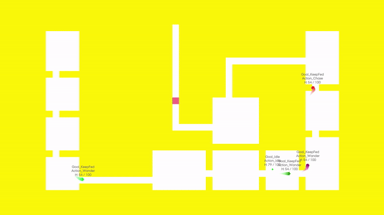
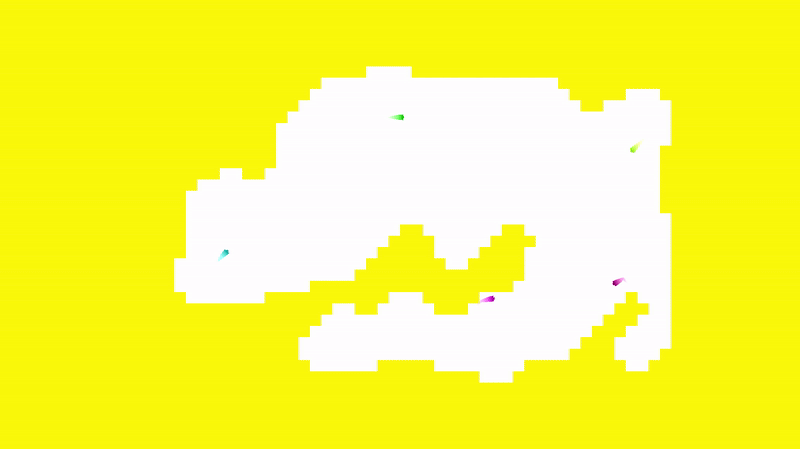

# AI and Procedural Content Generation

    

This project was developed as part of revisioning for the AI Programming exam, with a focus on exploring various AI and procedural content generation techniques.

## Concept

The goal of this project was to deepen understanding by implementing and experimenting with different AI strategies and procedural content generation (PCG) methods. This includes Goal-Oriented Action Planning (GOAP), Behavior Trees (BT), Binary Space Partitioning, and Cellular Automata.

## Features

### GOAP (Goal-Oriented Action Planning)

- **Dynamic Goal Handling**: This system allows agents to prioritize and pursue goals such as "Collect Resources" or "Defeat Enemies" based on the current game state.
- **Flexible Action Planning**: Agents can select from actions like `Move`, `Attack`, `Gather`, and `Flee`, dynamically adjusting their behavior based on available resources and threats.
- **Blackboard System**: A Blackboard is used to share information between different action and goal scripts, facilitating better coordination between the agent's decisions and actions.
- **Inspector Customization**: Users can configure goals and actions through the Unity Inspector, adjusting available parameters for goals and actions.

### Behavior Trees (BT)

- **Structured Decision-Making**: Behavior Trees are used to create modular AI behaviors. The included BT system supports common tasks like `Patrol`, `Attack`, and `Retreat`.
- **Sequential and Conditional Logic**: Composite nodes like `Sequence` and `Selector` are used to manage tasks, allowing for complex behavior compositions.

### Binary Partitioning PCG

- **Dungeon Generation**: This technique divides a space into smaller sections to generate grid-based dungeon layouts. The recursive partitioning ensures varied and efficient level design.
- **Configurable Parameters**: Users can adjust parameters such as the minimum room size and partitioning depth to create different dungeon styles.

### Cellular Automata PCG

- **Cave Generation**: Starting with a random grid, this method evolves the layout using cellular automata rules to create natural cave-like structures.
- **Rule Customization**: The evolution rules are customizable, allowing users to fine-tune the cave formation process by adjusting parameters like neighbor thresholds.

    

## Potential Enhancements

- **Behavior Tree Inspector Integration**: Adding the ability to customize and visualize Behavior Tree structures directly in the Unity Inspector could enhance usability and flexibility, allowing users to create and modify behaviors more intuitively.

## Example Scene

The project includes a `TestScene` where users can observe and interact with the AI and PCG systems. The GOAP AI stays dormant until energy is low, at which point it seeks out enemies to defeat and regain energy. The BT AI roams and attacks enemies upon detection. Both the dungeon and cave generation can be observed with adjustable parameters for real-time experimentation.

## Notes

The project further includes a grid system, a State AI and Pathfinding tools, which can be found individually [here](https://github.com/Nenniana/AI-State-Machine).